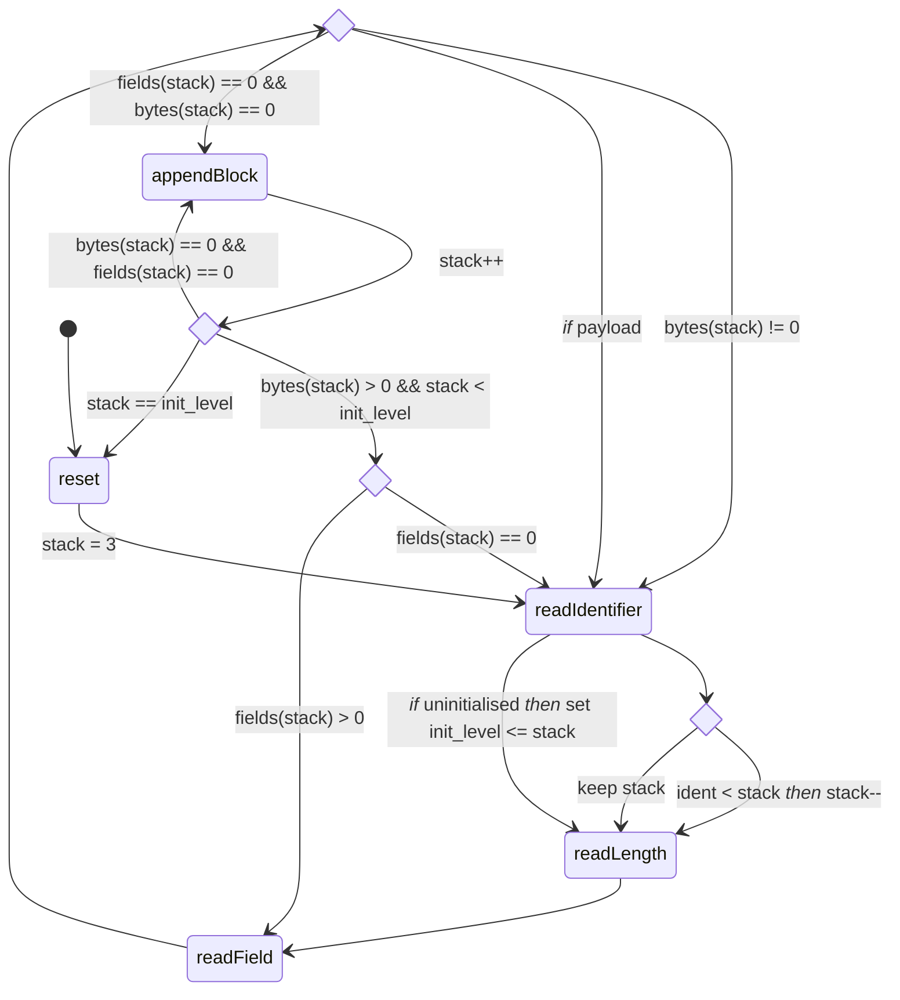

# Parser logic derivation

## Diagrams



Text diagram of reading packets with states
```
-------| +--+--+--+--+--+--+--+--+--+--+--+--+--+--+--+--+--+--+--+--+--+--+--+--
    L3:| >  ?  21 20 19 18 17 16 15 14 13 12 11 10 09 08 07 06 05 04 03 02 01 00
    F3:| >  2     1  0  0  0  0  0  0  0  0  0  0  0  0  0  0  0  0  0  0  0  0
-------| +--+--+--+--+--+--+--+--+--+--+--+--+--+--+--+--+--+--+--+--+--+--+--+--
    L2:|             >  7  6  5  4  3  2  1  0  >  9  8  7  6  5  4  3  2  1  0
    F2:|             >  2  1  0  0  0  0  0  0  >  3  2  1  1  1  1  1  1  1  0
-------| +--+--+--+--+--+--+--+--+--+--+--+--+--+--+--+--+--+--+--+--+--+--+--+--
    L1:|                      >  1  0  >  1  0           >  1  0  >  2  1  0
    F1:|                      >  1  0  >  1  0           >  1  0  >  2  1  0
Packet:| +--+--+--+--+--+--+--+--+--+--+--+--+--+--+--+--+--+--+--+--+--+--+--+--
       | D  2  1  *  R  7  *  B  1  *  V  1  *  M  9  *  E  1  *  C  2  *  *  *  
       | +--+--+--+--+--+--+--+--+--+--+--+--+--+--+--+--+--+--+--+--+--+--+--+--
 State:| [readIdentifier]                                                     
Action:| Previously uninitialied, assign block D, init_level=L3                                                        
 State:|    [readLength]                                                      
Action:|    Wait for 2 length bytes at L3                                                   
 State:|       [readLength]                                                   
Action:|       Assign bytes(L3)=20                                        
 State:|          [readField]                                                 
Action:|          Read field to D, fields(L3)=1, level = L3, bytes(L3) != 0, fields(L1)>0 go to readField
 State:|             [readField]                                                 
Action:|             SPECIAL CASE: next field is PAYLOAD, decrease field count and go to readIdentifer (consider decreasing buffer offset to compensate for payload jump)
 State:|             [readIdentifier]                                  
Action:|             New identifier level is less than current so move down stack, stack->L2
 State:|                [readLength]                                   
Action:|                Assign bytes(L2)=7
 State:|                   [readField]                                    
Action:|                   Read in field to R, fields(L2)= 0, bytes(L2) != 0, go to [rI]
 State:|                      [readField]                                    
Action:|                      SPECIAL CASE: next field is PAYLOAD, decrease field count and go to readIdentifer (consider decreasing buffer offset to compensate for payload jump)
 State:|                      [readIdentifier]                        
Action:|                      New identifier is less than current so move down stack to L1, assign identifier
 State:|                         [readLength]                         
Action:|                         Assign bytes(L1)=1                 
 State:|                            [readField]                        
Action:|                            Read field to B, fields(L1)=0, bytes(L1)=0, go to [appendBlock]
 State:|                            [appendBlock]
Action:|                            L1<init_level, save block, stack->L2, append to L2, fields(L2)=0, bytes(L2)=3 (>0), go to [rI]
 State:|                               [readIdentifier]                     
Action:|                               stack=L2, new identifier is less than current level, stack->L1, fields(L1)=1 (# fields)
 State:|                                  [readLength]                          
Action:|                                  Assign bytes(L1)=1
 State:|                                     [readField]                    
Action:|                                     Read field to V, fields(L1)=0, bytes(L1)=0, go to [appendBlock]
 State:|                                     [appendBlock]                    
Action:|                                     L1<init_level, save_block, stack->L2, append to L2, fields(L2)=0, bytes(L2)=0, go to [appendBlock]
 State:|                                     [appendBlock]                    
Action:|                                     L2<init_level, save_block, stack->L3, append to L3, fields(L3)=0, bytes(L3)=11 (>0), go to [rI]
 State:|                                        [readIdentifier]
Action:|                                        New identifier (L2) < stack level (L3), stack->L2, go to [rL]
 State:|                                           [readLength]
Action:|                                           Assign bytes(L2)=8
 State:|                                              [readField]
Action:|                                              Read field to M, fields(L2)=1, bytes(L2)=8, fields(L2) > 0 so go to [rF]
 State:|                                                 [readField]
Action:|                                                 SPECIAL CASE: next field is PAYLOAD, decrease field count and go to readIdentifer (consider decreasing buffer offset to compensate for payload jump)
 State:|                                                 [readIdentifier]
Action:|                                                 New identifier (E:L1) < stack level L2, stack->L1, go to [rL]
 State:|                                                    [readLength]
Action:|                                                    Assign bytes(L1)=1, go to [rF]
 State:|                                                       [readField]
Action:|                                                       Read field to E, fields(L1)=0, bytes(L1)=0, go to [appendBlock]
 State:|                                                       [appendBlock]
Action:|                                                       L1<init_level, save block, stack->L2, append to L2, fields(L2)=1, bytes(L2)=5 (>0) go to [rI]
 State:|                                                          [readIdentifier]
Action:|                                                          New identifier (C:L1) < stack (L2), stack->L1, go to [rL]
 State:|                                                             [readLength]
Action:|                                                             Assign bytes(L1)=2, go to [rF]
 State:|                                                                [readField]
Action:|                                                                Read field to C, fields(L1)=1, bytes(L1)=1, go to [readField]
 State:|                                                                   [readField]
Action:|                                                                   Read field to C, fields(L1)=0, bytes(L1)=0, go to [appendBlock]
 State:|                                                                   [appendBlock]
Action:|                                                                   L1<init_level, save block, stack->L2, append block to L2, fields(L2)=1, bytes(L2)=1, fields(L2)>0 go to [rF]
 State:|                                                                      [readField]
Action:|                                                                      Read field to M, fields(L2)=0, bytes(L2)=0, go to [appendBlock]
 State:|                                                                      [appendBlock]
Action:|                                                                      L2<init_level, save block, stack->L3, append block to L3, fields(L3)=0, bytes(L3)=0, bytes(L3) = 0 -> go to [appendBlock]
 State:|                                                                      [appendBlock]
Action:|                                                                      L3=init_level, save block to list, reset, go to [rI]
```